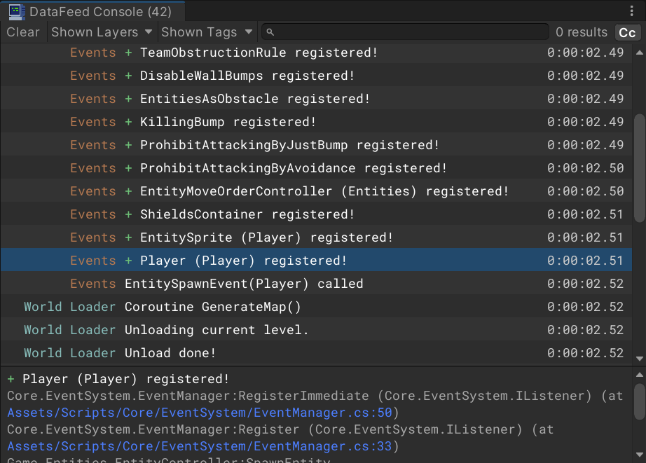
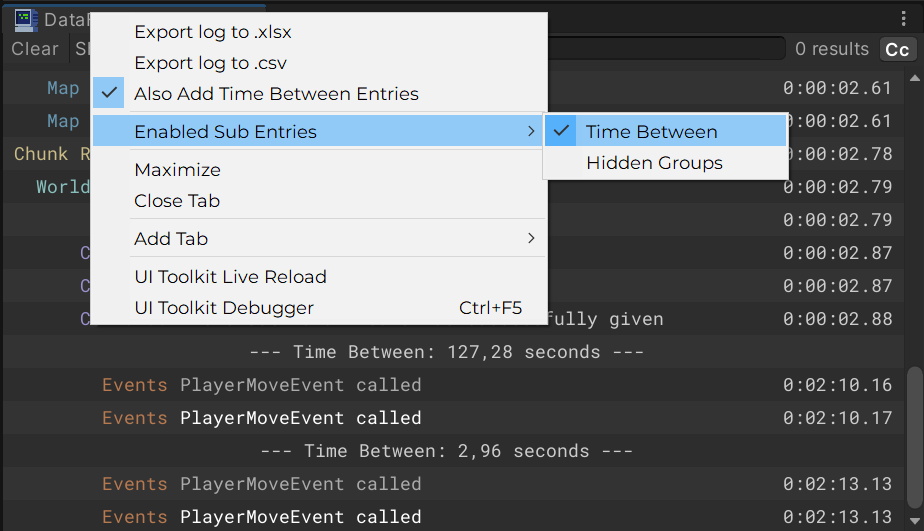
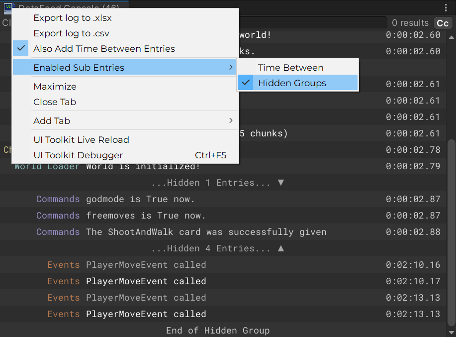
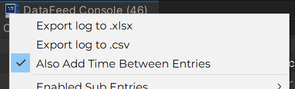

<p align="center"></p>

**DataFeed** is a reimagining of the standard Unity console. 

The functionality of DataFeed is divided into two windows:
1. **Log viewer window**
2. **Command input window** (Auxiliary to the first and optional)

<h2 align="center">Window Features</h2>
<h3>Log Viewer Window</h3>

Logs are displayed in a practical table format
> </br>

Support for customizable layers and tags for logs and filtering entries by them
> &emsp;&ensp;</br>

Auxiliary optional entries:
* Entry indicating a significant time difference between entries (useful for turn-based games)
> </br>
* Entry combining non-passed filter entries into a collapsible group
> </br>

Log export to .xlsx and .csv is accessible by console window menu. 
> </br>

* The exported logs will be located in the `ProjectFolder/Logs` folder.
* Default font for .xlsx tables is **Consolas**, you can change it in the DataFeed config.

<h3>Command Input Window</h3>

In addition to the command input line, it has a completion list. The list consists of two parts:

1. **Left** - displays completions based on existing commands and their arguments.
2. **Right** - displays a list of suitable commands based on previously entered commands.

> </br>

In addition to mouse clicks, the list fully supports keyboard control:

1. `Shift+U` - **Focus on input window**
2. `Tab` - **Toggle focus between input line and list**
3. `Arrows` - **Move through the completion list**
4. `uhjk` - **Alternative to `Arrows`**. You can change these keys in the config

<h2 align="center">Usage Guide</h2>

<h3>Where is the config?</h3>

Also you can access config file by following `Tools/Pukpukpuk/Open DataFeed Config` in Unity menu bar.

The config is located here: `Assets/Plugins/Pukpukpuk/DataFeed/Resources/DataFeed/`

<h3>How to send messages to the console?</h3>

`DebugUtils` class is responsible for console message output:

```cs
DebugUtils.Log("Hello World!");
DebugUtils.LogLayer("Hello World!", "Game", tag:"SomeTag");
```

<h3>How to make own commands?</h3>

Each command must inherit the `Pukpukpuk.DataFeed.Input.Command` class and have `Pukpukpuk.DataFeed.Input.CommandInfo` attribute. There is no need to register the command additionally.

The operation of the command is specified in the `Execute_hided()` method, and the list of completions in `GetCompletions()`. Other information is specified in the xml-comments of the `Command` class.

Command code example:
```cs
using System.Collections.Generic;
using System.Linq;
using Pukpukpuk.DataFeed.Input;

// False means that the command can be called not only while game is running
[CommandInfo("sum", false)]
public class SumCommand : Command
{
    private static readonly List<string> SuggestedNumbers = new() {"1", "2", "3"};
    
    // Command must return an output message after end of its work. 
    protected override string Execute_hided(string[] args, out bool isError)
    {
        // If isError is true, command output will be marked as error.
        isError = true;
        if (args.Length == 0) return "Not enough arguments!";

        var result = 0;
        foreach (var arg in args) 
        {
            if (!int.TryParse(arg, out var i))
            {
                return "One of the arguments is not an integer!";
            }

            result += i;
        }

        isError = false;
        return $"Sum: {result}";
    }

    public override List<string> GetCompletions(
        string lastArgument, 
        int lastArgumentIndex, 
        List<string> args)
    {
        return SuggestedNumbers
            .Where(number => !args.Contains(number))
            .ToList();
    }
}
```